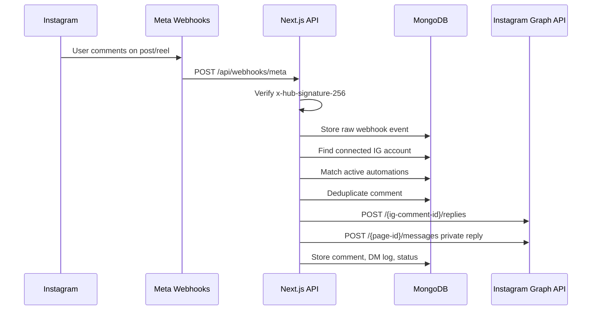

# Architecture

## Flow

## Main Modules

- `lib/meta.ts`: Graph API client, token exchange, signature validation, public replies, private replies.
- `lib/automation-engine.ts`: matching, dedupe, cooldowns, reply/DM orchestration.
- `lib/crypto.ts`: AES-256-GCM token encryption.
- `lib/auth.ts`: password hashing and JWT cookie auth.
- `prisma/schema.prisma`: MongoDB collections, indexes, unique constraints.
- `app/api/webhooks/meta/route.ts`: webhook verification and processing.
- `components/automation-builder.tsx`: screenshot-inspired automation builder UI.

## Scaling Plan

Small accounts can process webhooks inline. For production traffic:

1. Keep `POST /api/webhooks/meta` signature validation and raw insert synchronous.
2. Push processing work to a queue.
3. Return HTTP 200 quickly to Meta.
4. Worker processes events with per-account rate-limit buckets.
5. Store outbound delivery attempts in `dmLogs`.
6. Retry transient Graph API errors with exponential backoff.

## Data Retention

- Keep `commentEvents`, `dmLogs`, and `analyticsRollups` long term.
- Keep raw `webhookEvents` 14-30 days for debugging.
- Run `scripts/cleanup-webhook-logs.ts` or `POST /api/cron/cleanup-webhooks`.

## Security Controls

- HTTP-only same-site auth cookie.
- Password hashes with bcrypt.
- Encrypted Meta tokens using AES-256-GCM.
- Webhook signature validation.
- Basic in-memory route rate limiting for auth.
- CSRF-style origin check for mutation routes.
- Environment-only secrets.

For distributed production, replace the in-memory rate limiter with Redis/Upstash.
